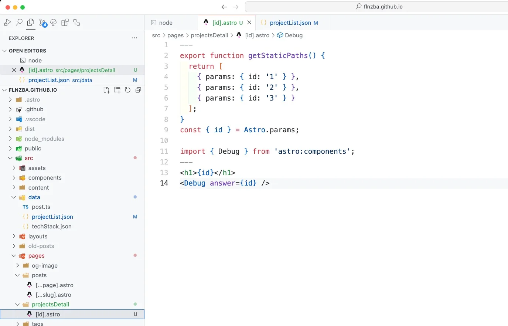
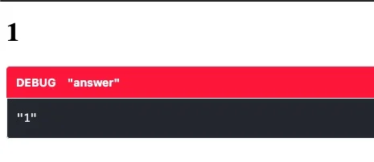
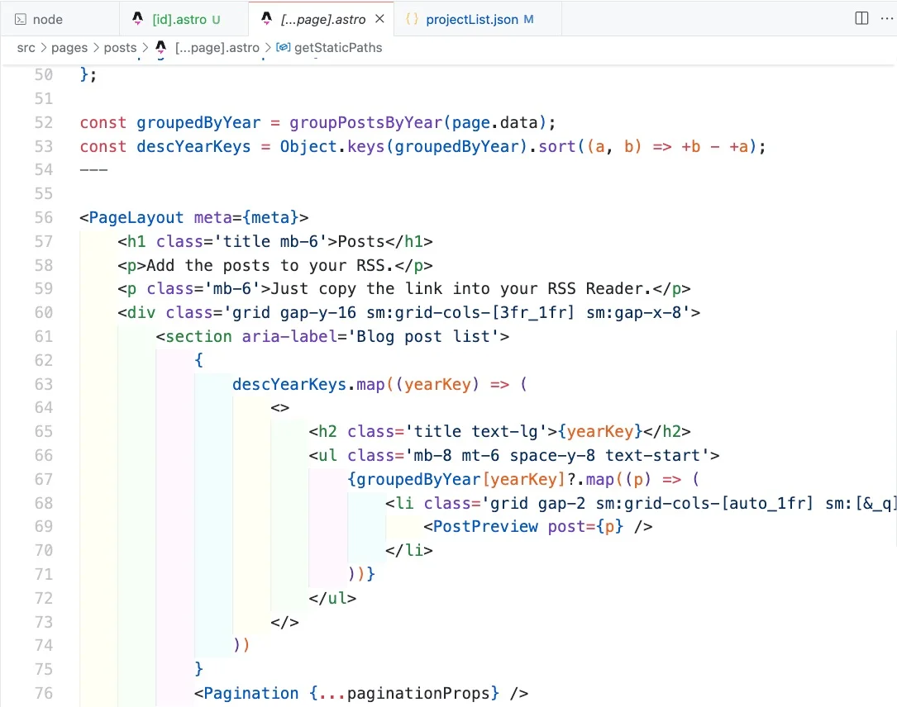

# Crafting Dynamic Pages in Astro: A Guide to Creating Individual Project Pages

## Setting Up Your Astro Project

Before diving into dynamic routing, ensure that your development environment is ready. If you haven’t already set up an Astro project, you'll need to do that first. Here’s how you can prepare your project for dynamic content generation:

1. **Create a Dedicated Folder**:

   - Begin by creating a folder named `projectsDetail` within the `src/pages` directory of your Astro project. This directory will specifically cater to dynamically created project pages, allowing you to organize your content effectively.

2. **Initialize a Dynamic Page Template**:
   - Within the `projectsDetail` folder, create a file named `[id].astro`. The `[id]` serves as a dynamic placeholder that will be replaced by unique identifiers for each project, allowing each project detail page to be generated based on the specific ID.

## Crafting the Dynamic Astro Page

The core of dynamic page generation in Astro is the setup of the `[id].astro` file. This file determines how each project's details are displayed and managed. Here’s a detailed setup:

```tsx
// File: src/pages/projectsDetail/[id].astro
---
export function getStaticPaths() {
  return [
    { params: { id: '1' } },
    { params: { id: '2' } },
    { params: { id: '3' } }
  ];
}
const { id } = Astro.params;

import { Debug } from 'astro:components';
---
<h1>{id}</h1>
<Debug answer={id} />
```

- **Defining Static Paths**:
  The `getStaticPaths` function is the main part for defining which paths should be pre-rendered at build time. In this example, paths for three project IDs are configured, ensuring that these pages are available immediately post-build.
- **Accessing Dynamic Parameters**:
  The dynamic ID from the URL is accessed via `Astro.params`, which in this example, is used to display the project ID on the page, ensuring that each page is personalized based on the project details.

- **Incorporating Debugging Tools**:
  The `<Debug>` component provided by Astro is used here to visually confirm that the correct data is passed and rendered, aiding in troubleshooting and development.



## Building and Testing the Dynamic Pages

After setting up your pages, the next steps involve building the project and testing the dynamically generated pages:

1. **Build the Project**:

   - Run `npm run build` or `pnpm build`. This command compiles your project and generates the necessary static files according to the configurations set in your Astro files.

2. **Preview and Test**:
   - Start your local development server by executing `npm run dev` or `pnpm preview`.
   - You will get the `localhost:4321` address to pop up in your browser. Now go to `localhost:4321/projectsDetail/1` . There should be a big number **1** on the screen. If you visit `localhost:4321/projectsDetail/2` there should be a big number **2** on the screen. The **1** or **2** in the url are the parameters we set in the `[id].astro` . So our build process generated the pages localhost:4321/projectsDetail/1, localhost:4321/projectsDetail/2 and localhost:4321/projectsDetail/3 at build time.



## Loading Parameters for Static Path from a JSON File

To make the dynamic routing more efficient and scalable, you can load the parameters for static paths from a JSON file. This approach allows you to manage and update the project details separately, ensuring that your dynamic pages are always up-to-date. Here’s how you can implement this feature:

1. **Create a JSON File**:

   - Begin by creating a JSON file named `projects.json` within the `src/data` directory of your Astro project. This file will contain the project details, including the unique identifiers for each project.

2. **Populate the JSON File**:
   - Populate the `projects.json` file with the project details, ensuring that each project has a unique identifier. Here’s an example structure:

```json
[
  {
    "id": "1",
    "title": "Project 1",
    "description": "This is the first project."
  },
  {
    "id": "2",
    "title": "Project 2",
    "description": "This is the second project."
  },
  {
    "id": "3",
    "title": "Project 3",
    "description": "This is the third project."
  }
]
```

3. **Load JSON Data in Astro**:
   - Update the `getStaticPaths` function in the `[id].astro` file to load the project details from the `projects.json` file. Here’s how you can modify the function:

```tsx
// File: src/pages/projectsDetail/[id].astro
---
import projects from 'src/data/projects.json';

export function getStaticPaths() {
  return projects.map((project) => ({
    params: { id: project.id }
  }));
}

const { id } = Astro.params;

const project = projects.find((p) => p.id === id);

if (!project) {
  throw new Error(`Project with id ${id} not found`);
}

const { title, desc, number } = project;

import { Debug } from 'astro:components';
---
<h1>{title}</h1>
<p>{desc}</p>
```

- **Importing JSON Data**:
  As seen now we do not have a static parameter list set to id=1, 2 and 3. Instead we are importing the `projects.json` file and mapping the project details to generate the static paths dynamically (with `map` function inside of the `getStaticPaths` function).

- **Loading JSON Data**:
  The `projects.json` file is imported into the `[id].astro` file, allowing you to access the project details within the Astro component. The `getStaticPaths` function is updated to map the project details and generate the static paths based on the unique identifiers.

  The `find` function is used to retrieve the project details based on the ID passed in the URL, ensuring that the correct project details are displayed on the page.

  The `const { title, desc, number } = project;` line is used to destructure the project details, allowing you to access the title and description of the project dynamically.

- **Displaying Project Details**:
  The project details are accessed using the `id` parameter, allowing you to display the title and description of each project dynamically on the page.

## Enhancing Your Dynamic Pages

When the dynamic routing works you then can set up your `[id].astro` to be a full fledged website which renders the layout from a `BaseLayout` (Template) and then generates a dedicated page for every content object (parameter) you describe in the `[id].astro` file.



## Conclusion

Dynamic routing is the core feature to use for blog post like sites to render pages dynamically.

Here are the links to the documentation which is very helpful:

- [Astro Dev](https://docs.astro.build/)
- [Astro Dynamic Routing](https://docs.astro.build/en/guides/routing/#dynamic-routes)
- [Astro Debugging](https://docs.astro.build/en/guides/troubleshooting/)
