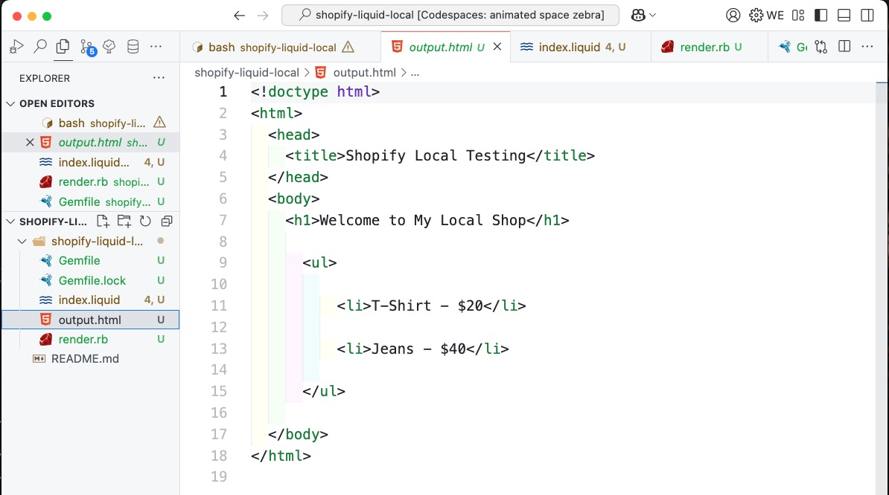

# Rendering Shopify Liquid Code Locally with VS Code

This guide explains how to set up a local development environment to render and test Shopify Liquid templates using VS Code.

What I like to do if I test code or software with which I usually do not interact with (in this case ruby) is to create a docker container (or a github codespace) with the necessary tools and dependencies. This way I can keep my local machine clean and I can easily share the environment with others.

## 1. Install Prerequisites

Ensure you have the following installed:

### a. Ruby

Shopify's Liquid engine runs on Ruby. Install Ruby using:

- **macOS:** `brew install ruby`
- **Windows:** [RubyInstaller](https://rubyinstaller.org/)
- **Linux:** `sudo apt install ruby`

Verify installation:

```bash
ruby -v
```

### b. Bundler

Install Bundler for Ruby gem management:

```bash
gem install bundler
```

### c. Node.js

Some front-end assets may rely on Node.js:

```bash
node -v
npm -v
```

Tip: In a Github-Codespace you can use the pre-installed ruby and node.js versions. You just need to install the bundler gem. (see image below)


## 2. Set Up Your Project Folder

1. Create a project folder:

   ```bash
   mkdir shopify-liquid-local && cd shopify-liquid-local
   ```

2. Initialize Ruby environment:

   ```bash
   bundler init
   ```

3. Edit `Gemfile` to include:

   ```ruby
   source "https://rubygems.org"
   gem "liquid"
   ```

4. Install dependencies:
   ```bash
   bundle install
   ```

## 3. Create a Basic Liquid Template

Create `index.liquid`:

```liquid
<!DOCTYPE html>
<html>
<head>
  <title>{{ title }}</title>
</head>
<body>
  <h1>Welcome to {{ site_name }}</h1>
  
    <ul>
      
        <li>{{ product.name }} - {{ product.price }}</li>
      
    </ul>
  
    <p>No products available.</p>
  
</body>
</html>
```

Tip: I recommend the extension ["Liquid"](https://marketplace.visualstudio.com/items?itemName=sissel.shopify-liquid) from panoply for syntax highlighting and autocompletion and the extension ["Shopify Liquid"](https://marketplace.visualstudio.com/items?itemName=Shopify.theme-check-vscode) from Shopify for formatting.

Tip: To get proper formatting click the right mouse button and select "Format Document With..." or use the shortcut "Shift+Alt+F". Select the "Shopify Liquid" formatter. This results in having the "Liquid" extension for syntax highlighting and autocompletion and the "Shopify Liquid" extension for formatting. (see images below)


## 4. Write a Ruby Script to Render Liquid

Create `render.rb`:

```ruby
require "liquid"

# Load the Liquid template
template_file = File.read("index.liquid")
template = Liquid::Template.parse(template_file)

# Define data
data = {
  "title" => "Shopify Local Testing",
  "site_name" => "My Local Shop",
  "products" => [
    { "name" => "T-Shirt", "price" => "$20" },
    { "name" => "Jeans", "price" => "$40" }
  ]
}

# Render template and save to HTML
output = template.render(data)
File.open("output.html", "w") { |file| file.write(output) }

puts "Template rendered to output.html"
```

## 5. Run the Script

Execute:

```bash
ruby render.rb
```

Open `output.html` in your browser.



## 6. Optional: Set Up Live Preview

### a. Option 1: Install HTTP Server with python OR node.js

- **Python:**

  ```bash
  python -m http.server
  ```

  Visit `http://localhost:8000`.

- **Node.js:**
  ```bash
  npm install -g http-server
  http-server
  ```

### b. Option2: VS Code Live Server Extension

1. Install the [Live Server](https://marketplace.visualstudio.com/items?itemName=ritwickdey.LiveServer) extension.
2. Right-click `output.html` and select **Open with Live Server**.

## 7. Optional: Enhance with Shopify Features

### a. Install Shopify CLI

1. Install Shopify CLI ([Guide](https://shopify.dev/docs/cli)).
2. Log in:
   ```bash
   shopify login
   ```

### b. Sync Changes Locally

Pull or create themes:

```bash
shopify theme pull --store your-store-name.myshopify.com
```

Run local preview:

```bash
shopify theme dev
```

## 8. Optional: Debugging and Testing

### a. VS Code Extensions

- [Shopify Liquid](https://marketplace.visualstudio.com/items?itemName=killalau.vscode-liquid) for syntax highlighting.
- [Prettier](https://marketplace.visualstudio.com/items?itemName=esbenp.prettier-vscode) for formatting.

### b. Debug Liquid Output

Use:

```liquid
{{ variable | json }}
```

### c. Ruby Debugging

Modify `render.rb` to print rendered output:

```ruby
puts template.render(data)
```

## 9. Advanced Setup

### a. Asset Compilation

Use Webpack or Gulp to compile assets (CSS/JS).

### b. Shopify Theme Check

Install Shopify Theme Check for linting:

```bash
gem install theme-check
theme-check
```

By following this guide, you can efficiently render and test Liquid templates locally.
