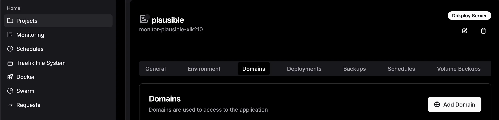

Dokploy is a powerful open-source deployment platform that makes it easy to run and manage projects in your own infrastructure. In this guide, we’ll go through the process of setting up a **Dokploy instance on a Hetzner server** and deploying your first service from a template (in this case, [Plausible Analytics](https://plausible.io/)).

This step-by-step tutorial will walk you from bare-metal provisioning all the way to serving your first application on a custom domain.

## 1. Provision a Hetzner Server

Start by creating a new server (Cloud or Dedicated) on [Hetzner Cloud](https://www.hetzner.com/).
For this tutorial, a small cloud instance is sufficient (for example, the CX22 plan with 4GB RAM).

Take note of the server’s **IP address** – we’ll use it later.


## 2. Generate an SSH Key

On your local machine, create an SSH key pair if you don’t already have one:

```bash
ssh-keygen -t ed25519 -f ~/.ssh/dokploy-key
```

By default, this generates two files inside `~/.ssh/`:

-   `dokploy-key` → your private key (keep this safe!)
-   `dokploy-key.pub` → your public key

To get your public key, run:

```bash
cat ~/.ssh/dokploy-key.pub
```

When opening the Hetzner server creation page, paste the contents of `dokploy-key.pub` into the **SSH Keys** section.


## 3. Connect to the Server

Open a terminal and log into the server:

```bash
ssh -i ~/.ssh/dokploy-key root@<SERVER-IP>
```

Replace `<SERVER-IP>` with the Hetzner IP address. If you leave out "~/.ssh/dokploy-key" you will be asked for the password instead of using the SSH key. This password is sent to your email when the server is created.

## 4. Install Dokploy

Once connected, run the following installation command provided by [Dokploy](https://dokploy.com/):

```bash
curl -sSL https://dokploy.com/install.sh | sh
```

This will install and start Dokploy on your server.

## 5. Access the Dokploy Dashboard

After installation, you can access the Dokploy dashboard by visiting:

```
http://<SERVER-IP>:3000
```

The dashboard should load, and you’ll be prompted to create your admin account.

## 6. Configure DNS

To use your own domain, create an **A record** in your DNS provider’s dashboard that points to the Hetzner server’s IP address.

Example:

```
@   A   yourdomain.com   <SERVER-IP>
```

## 7. Set Domain in Dokploy

Back in the Dokploy dashboard, go to **Webserver** → **Domain** and update the domain from the default IP to your actual domain.

## 8. Deploy a Service from Templates

Dokploy includes a set of pre-built templates for common services.

-   Open the **Projects** section and create a new project
-   Open the **Templates** section
-   Select **Plausible** (or another service of your choice)
-   Deploy it with a single click


## 9. Customize the Service Domain

Once the service is deployed, change its default domain to match your custom domain (for example: `analytics.yourdomain.com`).
You also need to set another A record in your DNS provider for this subdomain.

```
analytics   A   yourdomain.com   <SERVER-IP>
```



## 10. Redeploy the Service

After updating the domain, click **Deploy** again in the **General** Tab. Dokploy will restart the service with the new configuration and automatically configure SSL via Let’s Encrypt if you set the HTTPS-Switch to **on**.


## 🎉 Success!

You now have:

-   A running Dokploy instance on Hetzner
-   Your first project created and served from a custom domain
-   A monitoring/analytics service (Plausible) running via template

From here, you can explore more templates, deploy additional services, and manage everything through the Dokploy dashboard. There are a lot of interesting services integrated as templates, such as:

-   [n8n](https://n8n.io/) - Workflow Automation
-   [Uptime Kuma](https://uptime.kuma.pet/) - Self-hosted monitoring
-   [Ghost](https://ghost.org/) - Blogging platform
-   [OpenWebUI](https://openwebui.com/) - AI image generation
    and many more!

For more information, check out the [Dokploy documentation](https://docs.dokploy.com/).

Contact me for help or questions: [florian@fzeba.com](mailto:florian@fzeba.com)
