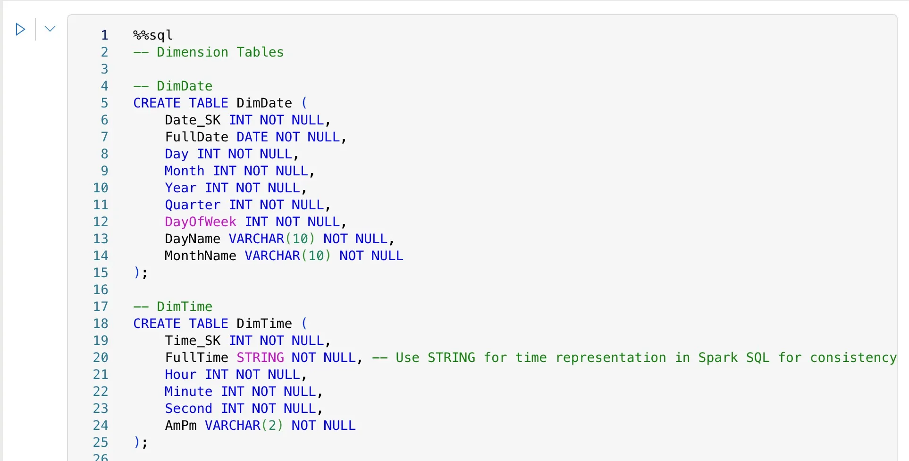

## TL;DR

**TL;DR:**

Built a US crime statistics ETL pipeline in Microsoft Fabric using the Medallion Architecture.

1.  **Bronze Layer:** Ingested messy, raw crime data.
2.  **Silver Layer:** Cleaned and transformed this data into a "One Big Table" (OBT) using Dataflow Gen2 (Power Query).
3.  **Gold Layer:** Created optimized fact and dimension tables from the OBT using efficient SQL scripts in a PySpark Notebook.
4.  **Semantic Model:** Defined explicit relationships between these tables to enable seamless analytics in dashboards.

This process transforms raw, messy data into a structured, performant model ready for insightful analysis.

## From Raw Chaos to Insight: Building a US Crime Statistics ETL Pipeline with Medallion Architecture in Microsoft Fabric

As software engineers, we often encounter the pristine, almost unnaturally clean datasets of Kaggle – perfect for machine learning, but rarely representative of the data challenges in the real world. The truth is, data is messy, incomplete, and often demands a robust pipeline to transform it into something usable. This article delves into building such an ETL (Extract, Transform, Load) pipeline for US crime statistics data, leveraging Microsoft Fabric's capabilities and the robust Medallion Architecture.

Our journey begins with the hunt for data that truly reflects the challenges of data engineering.

### The Quest for Dirty Data: Embracing the Bronze Layer

Initially, the thought might turn to readily available Kaggle datasets. However, these are typically pre-cleaned and structured, making them less ideal for demonstrating a real-world ETL process that tackles raw, often imperfect information. We needed something a little... grittier.

The process of finding public, suitably "dirty" data is a task in itself. It involves scouring government portals, open data initiatives, and sometimes, a good deal of data wrangling just to get it into a consumable format. For this project, we're simulating a scenario where we've sourced a CSV file, `Crime_Data_from_2020_to_Present.csv`, representing raw US crime statistics. This raw, untamed data forms our **Bronze layer** – the landing zone for all source data, exactly as it arrives. It's the wild west of data, where anything goes.

You can imagine this raw data sitting in a Lakehouse within Microsoft Fabric, perhaps within a folder like `01_Bronze` as seen in the provided image. This initial storage ensures data immutability and provides a historical record of all ingested data.


### Taming the Wild: Ingestion and Initial Transformation with Dataflow Gen2 (Silver Layer)

With our raw data in the Bronze layer, the next step is to introduce some order. This is where Microsoft Fabric's Dataflow Gen2 shines, making ETL accessible and, dare I say, enjoyable for the masses. Dataflow Gen2, powered by Power Query, provides a low-code/no-code interface to perform initial cleaning, type conversions, and basic transformations. It’s like bringing a civilizing force to our data’s wild west.

Our `Crime_Data_from_2020_to_Present.csv` is loaded into a Dataflow Gen2 pipeline. Looking at the Power Query editor, we can see typical transformations happening. For instance, dates might arrive as text strings (`11/07/2020` in the image), or even worse, mixed formats. Time values might be integers (`1845`), requiring conversion.

Consider the `Date_Occurance` column in our raw data. It might contain additional characters or be a simple string. Power Query allows us to elegantly handle such issues. The formula bar in the Power Query editor (as seen in the image) shows an example of `Table.TransformColumns` being used to process `Date_Occurance`:

`= Table.TransformColumns(#"Geänderter Spaltentyp", {{"Date_Occurance", each Text.BeforeDelimiter(_, " ", 0), type text}})`

This M-code snippet demonstrates how we can parse a date string, perhaps removing extraneous time information, and explicitly setting its type. Similar transformations would be applied to other columns:

-   Converting `Date_Reported` and `Date_Occurance` to proper date types.
-   Parsing `Time_Occurance` (e.g., `1845`) into a usable time format.
-   Handling missing values in critical columns.
-   Renaming columns for clarity.

The outcome of this Dataflow Gen2 process is a single, large table, which we affectionately call the One Big Table (OBT). This OBT is automatically saved into the Data Lake, typically residing in a folder like `02_Silver` as part of our **Silver layer**. This layer represents cleaned, conformed data that is ready for further refinement and dimensional modeling. It's still broad, containing all necessary columns, but now it's structurally sound.





### Sculpting for Performance: Dimensional Modeling with PySpark Notebooks

We transition to a PySpark Notebook (`create_model` in the image) within Microsoft Fabric. While Pandas or PySpark DataFrames could handle these transformations, for efficiency and directness in a SQL-centric data warehouse context, we opt to write our transformation logic using SQL. This allows us to leverage Spark SQL’s optimized query engine.

There are two main approaches to creating dimension and fact tables from our OBT:

1.  **Duplicate and Delete:** Load the OBT, duplicate it for each dimension, and then delete unnecessary columns. This is straightforward but computationally intensive, especially for large datasets, as it involves many large table operations.
2.  **Create New with Specific Columns (Our Choice):** Write SQL scripts to select only the necessary columns, apply transformations, and insert them into new, focused dimension tables. This involves more initial coding but is far more efficient in execution, as it processes only the required data.

We're going with Option 2 – write more code now, reap performance benefits later! This choice is particularly apt for a software engineer.

Below are examples of how we create our dimension and fact tables using SQL within a PySpark Notebook. The `%sql` magic command allows us to execute SQL statements directly.

First, let's create our dimension tables. These capture descriptive attributes.

```sql
-- Populating DimDate
INSERT INTO DimDate (Date_SK, FullDate, Day, Month, Year, Quarter, DayOfWeek, DayName, MonthName)
SELECT
    ROW_NUMBER() OVER (ORDER BY FullDate) AS Date_SK,
    FullDate,
    DAY(FullDate) AS Day,
    MONTH(FullDate) AS Month,
    YEAR(FullDate) AS Year,
    QUARTER(FullDate) AS Quarter,
    DAYOFWEEK(FullDate) AS DayOfWeek, -- 1=Sunday, 2=Monday, ...
    DATE_FORMAT(FullDate, 'EEEE') AS DayName, -- Full weekday name
    DATE_FORMAT(FullDate, 'MMMM') AS MonthName -- Full month name
FROM (
    SELECT DISTINCT CAST(Date_Reported AS DATE) AS FullDate FROM CrimesData WHERE Date_Reported IS NOT NULL
    UNION
    SELECT DISTINCT CAST(Date_Occurance AS DATE) AS FullDate FROM CrimesData WHERE Date_Occurance IS NOT NULL
) AS AllDates
WHERE FullDate IS NOT NULL;
```

This `DimDate` population script (directly from the provided SQL notebook image) intelligently extracts distinct dates from both `Date_Reported` and `Date_Occurance`, ensuring all relevant dates are captured for our analysis. It then generates various date attributes, including a unique `Date_SK` (Surrogate Key).

Next, we tackle time. Our raw data provided `Time_Occurance` as a four-digit integer (e.g., `1230` for 12:30 PM). This requires careful parsing.

```sql
-- Populating DimTime
INSERT INTO DimTime (Time_SK, FullTime, Hour, Minute, Second, AmPm)
SELECT
    ROW_NUMBER() OVER (ORDER BY FormattedTime) AS Time_SK,
    FormattedTime AS FullTime,
    HOUR(CAST(FormattedTime AS TIMESTAMP)) AS Hour,
    MINUTE(CAST(FormattedTime AS TIMESTAMP)) AS Minute,
    SECOND(CAST(FormattedTime AS TIMESTAMP)) AS Second,
    DATE_FORMAT(CAST(FormattedTime AS TIMESTAMP), 'a') AS AmPm -- 'a' for AM/PM in Spark SQL
FROM (
    SELECT DISTINCT -- Ensure unique formatted times for the dimension table
        CONCAT(
            SUBSTRING(LPAD(CAST(Time_Occurance AS STRING), 4, '0'), 1, 2),
            ':',
            SUBSTRING(LPAD(CAST(Time_Occurance AS STRING), 3, 2)),
            ':00'
        ) AS FormattedTime -- Converts '1230' to '12:30:00'
    FROM CrimesData
    WHERE Time_Occurance IS NOT NULL
) AS ParsedUniqueTimes
WHERE FormattedTime IS NOT NULL;
```

This script (also from the SQL notebook image) is a prime example of real-world data cleaning. It takes the `Time_Occurance` integer, pads it with leading zeros if necessary (e.g., `845` becomes `0845`), then carefully substrings it to form a valid time string (`HH:MM:SS`), and finally casts it to a TIMESTAMP to extract hour, minute, second, and AM/PM indicators. This is precisely the kind of detailed work ETL pipelines are built for.

Following similar patterns, we create other dimension tables:

```sql
-- Populating DimCriminal
INSERT INTO DimCriminal (Criminal_SK, Criminal_Code, Criminal_Code_1, Criminal_Code_2, Criminal_Code_Description)
SELECT
    ROW_NUMBER() OVER (ORDER BY Criminal_Code, Criminal_Code_1, Criminal_Code_2) AS Criminal_SK,
    Criminal_Code,
    Criminal_Code_1,
    Criminal_Code_2,
    Criminal_Code_Description
FROM (
    SELECT DISTINCT Criminal_Code, Criminal_Code_1, Criminal_Code_2, Criminal_Code_Description
    FROM CrimesData
    WHERE Criminal_Code IS NOT NULL
) AS UniqueCriminals;

-- Populating DimArea
INSERT INTO DimArea (Area_SK, AREA_Code, AREA_Name, District_No_Reported)
SELECT
    ROW_NUMBER() OVER (ORDER BY AREA, AREA_Name) AS Area_SK,
    AREA AS AREA_Code,
    AREA_Name,
    District_No_Reported
FROM (
    SELECT DISTINCT AREA, AREA_Name, District_No_Reported
    FROM CrimesData
    WHERE AREA IS NOT NULL
) AS UniqueAreas;

-- Populating DimMocode (Modus Operandi Code)
INSERT INTO DimMocode (Mocode_SK, Mocode_Code)
SELECT
    ROW_NUMBER() OVER (ORDER BY Mocode_Code) AS Mocode_SK,
    Mocode_Code
FROM (
    SELECT DISTINCT Mocode_Code
    FROM CrimesData
    WHERE Mocode_Code IS NOT NULL
) AS UniqueMocodes;

-- Populating DimPart (Part of Crime)
INSERT INTO DimPart (Part_SK, Part_Code)
SELECT
    ROW_NUMBER() OVER (ORDER BY Part) AS Part_SK,
    Part AS Part_Code
FROM (
    SELECT DISTINCT Part
    FROM CrimesData
    WHERE Part IS NOT NULL
) AS UniqueParts;

-- Populating DimPremise
INSERT INTO DimPremise (Premise_SK, Premis_CD, Premis_Description)
SELECT
    ROW_NUMBER() OVER (ORDER BY Premis_CD) AS Premise_SK,
    Premis_CD,
    Premis_Description
FROM (
    SELECT DISTINCT Premis_CD, Premis_Description
    FROM CrimesData
    WHERE Premis_CD IS NOT NULL
) AS UniquePremises;

-- Populating DimStatus
INSERT INTO DimStatus (Status_SK, Status_Code, Status_Description)
SELECT
    ROW_NUMBER() OVER (ORDER BY Status, Status_Description) AS Status_SK,
    Status AS Status_Code,
    Status_Description
FROM (
    SELECT DISTINCT Status, Status_Description
    FROM CrimesData
    WHERE Status IS NOT NULL
) AS UniqueStatuses;

-- Populating DimVictim
INSERT INTO DimVictim (Victim_SK, Victim_Age, Victim_Descent, Victim_Gender)
SELECT
    ROW_NUMBER() OVER (ORDER BY Victim_Age, Victim_Descent, Victim_Gender) AS Victim_SK,
    Victim_Age,
    Victim_Descent,
    Victim_Gender
FROM (
    SELECT DISTINCT Victim_Age, Victim_Descent, Victim_Gender
    FROM CrimesData
    WHERE Victim_Age IS NOT NULL OR Victim_Descent IS NOT NULL OR Victim_Gender IS NOT NULL
) AS UniqueVictims;

-- Populating DimWeapon
INSERT INTO DimWeapon (Weapon_SK, Weapon_Used_Code, Weapon_Description)
SELECT
    ROW_NUMBER() OVER (ORDER BY Weapon_Used_Code, Weapon_Description) AS Weapon_SK,
    Weapon_Used_Code,
    Weapon_Description
FROM (
    SELECT DISTINCT Weapon_Used_Code, Weapon_Description
    FROM CrimesData
    WHERE Weapon_Used_Code IS NOT NULL
) AS UniqueWeapons;
```

Once all our dimension tables are populated, we can construct our central `FactCrime` table. This table contains the measures and foreign keys linking back to our dimension tables.

```sql
-- Populating FactCrime
INSERT INTO FactCrime (
    Date_SK, Time_SK, Area_SK, Criminal_SK, Mocode_SK, Part_SK, Premise_SK, Status_SK, Victim_SK, Weapon_SK,
    DR_NO, LAT, LON, LOCATION, DateOccurance_SK, TimeOccurance_SK, DateReported_SK
)
SELECT
    dd.Date_SK,
    dt.Time_SK,
    da.Area_SK,
    dc.Criminal_SK,
    dm.Mocode_SK,
    dp.Part_SK,
    dpr.Premise_SK,
    ds.Status_SK,
    dv.Victim_SK,
    dw.Weapon_SK,
    cd.DR_NO,
    cd.LAT,
    cd.LON,
    cd.LOCATION,
    dd_occ.Date_SK AS DateOccurance_SK, -- Join specifically for Date_Occurance
    dt_occ.Time_SK AS TimeOccurance_SK, -- Join specifically for Time_Occurance
    dd_rep.Date_SK AS DateReported_SK   -- Join specifically for Date_Reported
FROM
    CrimesData AS cd
LEFT JOIN
    DimDate AS dd_occ ON CAST(cd.Date_Occurance AS DATE) = dd_occ.FullDate
LEFT JOIN
    DimTime AS dt_occ ON CONCAT(
                            SUBSTRING(LPAD(CAST(cd.Time_Occurance AS STRING), 4, '0'), 1, 2),
                            ':',
                            SUBSTRING(LPAD(CAST(cd.Time_Occurance AS STRING), 3, 2)),
                            ':00'
                        ) = dt_occ.FullTime
LEFT JOIN
    DimDate AS dd_rep ON CAST(cd.Date_Reported AS DATE) = dd_rep.FullDate
LEFT JOIN
    DimArea AS da ON cd.AREA = da.AREA_Code AND cd.AREA_Name = da.AREA_Name
LEFT JOIN
    DimCriminal AS dc ON cd.Criminal_Code = dc.Criminal_Code
LEFT JOIN
    DimMocode AS dm ON cd.Mocode_Code = dm.Mocode_Code
LEFT JOIN
    DimPart AS dp ON cd.Part = dp.Part_Code
LEFT JOIN
    DimPremise AS dpr ON cd.Premis_CD = dpr.Premis_CD
LEFT JOIN
    DimStatus AS ds ON cd.Status = ds.Status_Code
LEFT JOIN
    DimVictim AS dv ON cd.Victim_Age = dv.Victim_Age AND cd.Victim_Descent = dv.Victim_Descent AND cd.Victim_Gender = dv.Victim_Gender
LEFT JOIN
    DimWeapon AS dw ON cd.Weapon_Used_Code = dw.Weapon_Used_Code;
```

With these steps, our meticulously cleaned and structured data now resides in the **Silver layer**, a pristine set of fact and dimension tables (as depicted in the data model diagram). This data is optimized for high-performance analytical queries and reporting.

Creating the semantic model looks like this:


What we get is a beautiful star schema, optimized for performance and usability in analytics.


### Forging Connections: The Semantic Model (Gold Layer)

Our Gold layer tables in the Data Lake are incredibly valuable, but there's a crucial missing piece for robust analytics: enforced relationships. In a typical data lake and PySpark Notebook environment, primary keys and foreign keys are not inherently enforced. This means that while we've designed a star schema, the connections between our fact and dimension tables aren't explicitly recognized by downstream tools.

Enter the **Semantic Model**. In Microsoft Fabric, we create a Semantic Model as an object in our workspace (visible as `us-crime-statistics-model` in the Silver layer, and during the "Tabellen aus OneLake auswählen" step). This model acts as a blueprint, allowing us to visually define the relationships between our fact and dimension tables. It's where we assert the very foreign key and primary key relationships that give our star schema its power.

Referring to the data model diagram, we can visually establish the 1-to-many relationships:

-   `FactCrime` links to `DimDate` (for both occurrence and reported dates), `DimTime`, `DimArea`, `DimCriminal`, `DimMocode`, `DimPart`, `DimPremise`, `DimStatus`, `DimVictim`, and `DimWeapon`.

These relationships are vital. They tell reporting tools like Power BI how to correctly join the tables, enabling seamless drill-downs, aggregations, and filtering across our crime statistics. Without the semantic model, building a comprehensive dashboard would be a manual, error-prone, and inefficient process. It essentially translates the complex underlying data structure into an intuitive, ready-to-use model for business intelligence.


### Conclusion

Our journey from raw, "dirty" US crime statistics to a fully functional, performance-optimized analytical model showcases the power of Microsoft Fabric and the Medallion Architecture.

We began in the **Bronze layer** with raw CSV data, embracing its imperfections. We then used Dataflow Gen2 (Power Query) to bring order and cleanliness, creating a cohesive One Big Table in the **Silver layer**. Finally, we leveraged PySpark Notebooks with efficient SQL scripting to sculpt this OBT into a robust dimensional model of fact and dimension tables, residing in the **Gold layer**. The crucial step of defining relationships in the **Semantic Model** ensured that our beautifully structured data could be effortlessly consumed by analytical tools, turning raw chaos into actionable insights.

This methodical approach not only ensures data quality and consistency but also dramatically improves the performance and usability of our data assets, providing a solid foundation for any data-driven decision-making.
