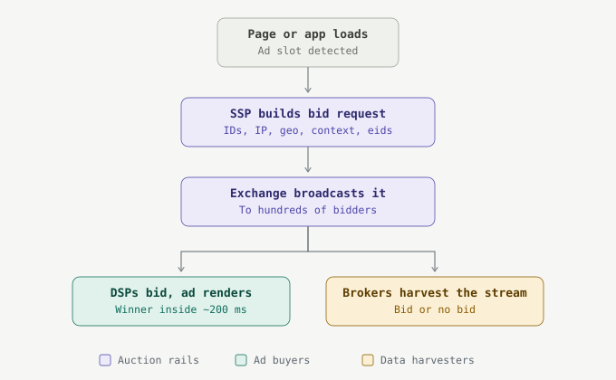
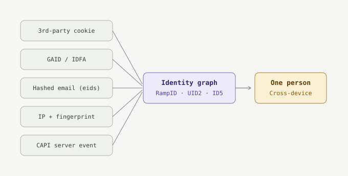
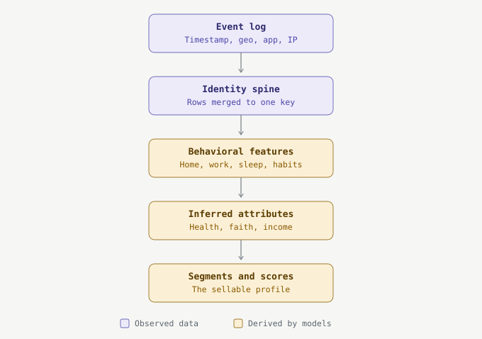
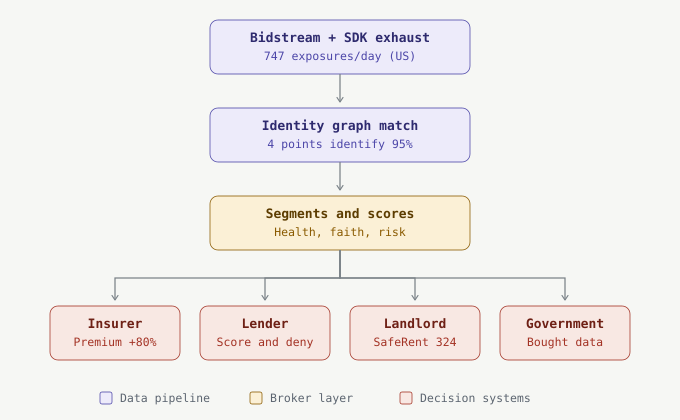

_Technical long read · surveillance advertising · Draft v1 · August 2026 · sources and caveats at the end._

## 01 · The impression — Two hundred milliseconds

Maya opens a free flashlight app on her Android phone while waiting for a bus. In the fifth of a second before a banner ad appears at the bottom of the screen, the app's ad SDK assembles a message: her device's advertising ID, her IP address, her latitude and longitude to roughly ten meters, her phone model, her carrier, the app she is standing inside, and a set of identity tokens linking this moment to every other moment vendors have previously matched to her. A supply-side platform wraps the message into a bid request. An exchange broadcasts it to hundreds of bidding servers. Demand-side platforms consult her profile, price her attention, and bid. One wins. The ad renders. Maya never sees any of it.

The auction is over in about 200 milliseconds. The data is not. Companies that lost the auction — and companies that never intended to bid at all — keep what the broadcast contained. The Irish Council for Civil Liberties estimates this happens to the average American 747 times a day. Eighteen months from now, a version of what left Maya's phone at that bus stop will sit inside a risk score on a loan officer's screen. This article traces the path.

<figure>
  
  <figcaption>Fig. 1 — One impression, one auction. The bid request leaves the device before any ad is chosen; everyone who receives the broadcast receives the data, whether or not they bid.</figcaption>
</figure>

## 02 · The payload — Anatomy of a bid request

The message that leaves Maya's phone is not a proprietary secret. Its schema is a public standard: OpenRTB, maintained by the IAB Tech Lab, with version 2.6 (April 2022) as the industry mainstream and a 3.0/AdCOM track alongside it. JSON is the suggested encoding; Google recommends Protobuf on its Authorized Buyers pipes. The roles are simplest to hold as a stock exchange for attention: the SSP (supply-side platform) is the seller's broker, listing the app's ad slot; DSPs (demand-side platforms) are the buyers' brokers, bidding on behalf of advertisers; the exchange between them runs the auction. The interesting part is which fields the standard reserves for describing the person.

The `Device` object carries the hardware identity: `device.ifa` holds the resettable advertising identifier — GAID on Android, IDFA on iOS — alongside the IP address, user-agent, OS, model, and connection type. Nested inside it, the `Geo` object carries latitude and longitude with a `type` flag declaring whether the fix came from GPS, IP inference, or user-supplied data, and an `accuracy` field in meters. The `App` or `Site` object names the context: bundle ID or domain, page URL, publisher, and an optional `Content` object describing what the person is reading or watching. The `User` object is where cross-company identity lives: its `eids` (Extended Identifiers) array lists identity tokens, each naming a `source` domain — the vendor that minted the ID — and the ID itself. The `Source` object's `schain` lists every intermediary that touched the request. `Regs` carries the privacy flags: GDPR applicability, US state privacy strings, and in the EU a consent string that is itself, per the Court of Justice of the EU, personal data.

```json
{
  "id": "9a2e77c1-b4d0-4f41",                // auction ID
  "imp": [{ "banner": {"w":320,"h":50}, "bidfloor": 0.42 }],
  "app": {
    "bundle": "com.example.flashlight",      // which app she is in
    "publisher": { "id": "pub-88123" }
  },
  "device": {
    "ua": "Mozilla/5.0 (Linux; Android 14; Pixel 8)",
    "ip": "203.0.113.87",                     // household-level ID
    "ifa": "38400000-8cf0-11bd-b23e-10b96e40000d",  // GAID
    "geo": { "lat": 52.5201, "lon": 13.4049,
             "type": 1, "accuracy": 10 },     // GPS, ~10 m
    "os": "android", "model": "Pixel 8"
  },
  "user": {
    "eids": [                                  // identity graph hooks
      { "source": "liveramp.com", "uids": [{"id":"XY9c…"}] },
      { "source": "uidapi.com",   "uids": [{"id":"AdvJK…"}] }
    ]
  },
  "source": { "schain": { /* every intermediary hop */ } },
  "regs": { "ext": { "gdpr": 0 } }
}
```

<aside class="space-y-4 border-l-2 border-ultra bg-surface-2 px-5 py-4">

**Worked example · what one recipient learns from this single request**

Reading the payload above as any of the hundreds of receiving servers would:

- _Where she is:_ lat/lon with `type: 1` means a GPS fix, accurate to ~10 m — a specific bus stop, not a city.
- _When and what she's doing:_ the request timestamp plus `bundle: com.example.flashlight` — phone in hand, in a utility app, on the move.
- _What she can afford:_ `model: Pixel 8` and OS version are standard inputs to modeled-income bands.
- _Which household she belongs to:_ `ip: 203.0.113.87` recurs every evening from her apartment — a stable household key even when every other ID is reset.
- _Who she is everywhere else:_ the two `eids` tokens are join keys into LiveRamp's and UID2's graphs — this moment is now appended to a file, not floating free.

One request is a snapshot. At 747 requests a day, the snapshots become a motion picture.

</aside>

Two details in this schema matter more than the rest. First, the `eids` array is a live wire into commercial identity infrastructure: a bidder holding a matching LiveRamp or Unified ID 2.0 token does not see an anonymous device — it sees a node in a graph it can join to purchase history, email-derived identity, and offline records. Second, the values are not always observed; they are frequently _inferred_. In 2024 the IAB Tech Lab convened a workstream of more than 80 participants across 40 companies to patch OpenRTB 2.6 after the "ID bridging" controversy — sellers populating `device.ifa` or `user.buyeruid` with identifiers the device never emitted, derived from IP or probabilistic matching. The fix added provenance metadata to the EID field so buyers can see who generated an identifier and how. Read that as an on-the-record admission: the identity signals in the bidstream are routinely manufactured.

One structural point completes the picture. The auction is a broadcast, not a negotiation. Header bidding — the now-dominant pattern in which many demand partners are solicited simultaneously rather than in a sequential waterfall — raises publisher yield precisely by multiplying the number of servers that receive each request. There is no technical mechanism that controls what a recipient does with a bid request after it arrives. Exchange policies prohibit retaining data from failed bids; the FTC's complaint against data broker Mobilewalla alleges it harvested and kept exactly that, at scale, from auctions it never intended to win.

## 03 · The volume — A broadcast measured in trillions

The best available count of the broadcast comes from the Irish Council for Civil Liberties, whose May 2022 report "The Biggest Data Breach" put real-time bidding at 178 trillion broadcasts per year across the US and Europe — 747 exposures per day for the average American, 376 for the average European. Google's pipes alone were broadcasting roughly 31 billion times daily in the US, and Google's own authorization list showed 4,698 companies cleared to receive RTB data about US users. ICCL valued the market at over $117 billion across the US and Europe in 2021.

> **Caveat:** these figures come from an advocacy organization, derived from industry data ICCL attributes to a confidential source. They are the field's standard citations and no better public count exists, but treat them as order-of-magnitude estimates, not audited totals.

Downstream of the broadcast sits the broker layer. Acxiom, the archetype, has advertised holdings of more than 11,000 data attributes on 2.5 billion consumers — up from roughly 3,000 attributes on 700 million people when the FTC surveyed the industry in its 2014 report. The Electronic Privacy Information Center estimates more than 4,000 data-broker firms operate worldwide. Market-size estimates for the industry range from roughly $131 billion to $278 billion for 2024 depending on the research firm and the definition — a dispersion that is itself informative: nobody, including regulators, can bound the industry precisely.

## 04 · Identity resolution — How an "anonymous" device becomes you

The raw bidstream is pseudonymous — a cloud of device IDs, cookies, and IPs. The profiling industry's core competence is collapsing that cloud into persons. The mechanisms, in ascending order of durability:

_Cookie syncing._ Browsers wall cookies off per domain: adco-a.example cannot read adco-b.example's cookie. So the two companies trade. A page embeds A's invisible pixel; A answers not with an image but with a redirect to `adco-b.example/sync?partner=a&uid=A123`, carrying its own ID for this browser in the URL. B receives the redirect, reads its own cookie — say `B987` — and writes down the pair: A's `A123` is B's `B987`. From then on, when A broadcasts a bid request containing `A123`, B recognizes the person behind it instantly. Multiply this handshake across hundreds of firms and you get the ecosystem's shared translation table — the reason a stranger's server can act on an ID it never issued.

_Deterministic identity graphs._ The durable anchor is the email address. Say Maya logs into a recipe site with `maya.k@example.com`. The site's identity partner hashes it — SHA-256 turns it into a fixed string like `5f4dcc3b…` — and mints a token for that hash. Hashing sounds protective; it is the opposite of protective here, because the same email always produces the same hash: it is a join key, not a disguise. Weeks later, on a different device and a different network, Maya logs into a news app with the same email. Same hash, same token — and now the token rides the `eids` array of bid requests from both devices. This is what LiveRamp's RampID, The Trade Desk's Unified ID 2.0, and ID5 industrialize. A hashed email survives every cookie purge, device upgrade, and IP change Maya will ever perform.

_Probabilistic device graphs and fingerprinting._ Where no login exists, vendors infer. Maya's phone, laptop, and TV all appear behind IP `203.0.113.87` every night between 7 pm and 7 am: with high confidence, one household — and the phone and laptop moving together to a second IP each weekday morning are one person within it. Separately, her laptop's browser leaks a configuration: installed fonts, how its GPU renders an invisible test image (canvas), screen 2560×1600, timezone, language, header ordering. No single attribute identifies her; the combination is often unique among hundreds of thousands of browsers, and it persists after she clears every cookie. Deleting cookies removes the label from the file, not the file.

_Server-side collection._ Meta's Conversions API and Google's Enhanced Conversions move tracking where no browser setting can see it. Concretely: Maya buys running shoes online with an ad blocker on, so the shop's Meta pixel never fires. It doesn't matter — after checkout, the shop's own server sends Meta a CAPI event containing her hashed email, hashed phone number, and the $89 order. The traffic is server-to-server; from the browser's perspective, nothing happened. Blocking, here, is a category error: the collection point moved behind the counter.

_SDKs._ In mobile apps, the tracker is compiled into the product. The flashlight app's ad SDK reads the GAID and GPS coordinates every time it requests an ad — that routine call _is_ the collection event. And SDKs need not be advertising at all: the State of Texas alleges Allstate's Arity unit paid app developers millions to embed its SDK in apps like Life360 and GasBuddy, assembling driving-behavior data on more than 45 million consumers — trillions of miles — from people who never interacted with Allstate and were using, as far as they knew, a gas-price app.

<figure>
  
  <figcaption>Fig. 2 — Resolution. Fragile signals (cookies, resettable IDs) are joined to durable ones (hashed emails, server-side events) until the profile survives any single control a person can operate.</figcaption>
</figure>

The mathematics guarantee the outcome. In 2013, de Montjoye, Hidalgo, Verleysen and Blondel analyzed fifteen months of mobility data from 1.5 million people and showed that four spatio-temporal points — four instances of "this device was here at this hour" — uniquely identify 95% of individuals. Uniqueness decays only as the one-tenth power of resolution: coarsening the data barely helps. A 2025 replication found four points still identify up to 93% of people at country scale. This is why "anonymized" is not a defense the FTC accepts anymore; its complaints against Kochava and Avast rest on exactly this science. Home plus workplace plus one clinic visit plus one place of worship is not an anonymous device. It is a name with extra steps.

## 05 · The profile — Segments, scores, and what they say about you

Once resolved, the exhaust is packaged. The unit of sale is the segment: a named audience list — effectively a set of person-level IDs sharing an attribute — that an advertiser rents access to, typically for a per-thousand-impressions data fee, through data marketplaces and the platforms formerly called DMPs. A segment has a taxonomy code, a plain-English name, and a price. What it does not have is a fact-checking department.

<aside class="space-y-4 border-l-2 border-ultra bg-surface-2 px-5 py-4">

**Worked example · one week of Maya's exhaust, translated into product**

What the pipeline observed, and what it sold:

- _Observed:_ GPS dwell at the same gym geofence, 07:40, three mornings. _Sold as:_ "fitness enthusiast."
- _Observed:_ a 45-minute Tuesday dwell inside a medical building whose tenant list includes an OB-GYN practice. _Sold as:_ a candidate for an "expectant parent" segment — the same inference pattern the FTC's Mobilewalla complaint documents from pregnancy-center visits.
- _Observed:_ three devices behind one evening IP, address geocoded to a rental complex. _Sold as:_ "renter, 2-person household."
- _Observed:_ Pixel 8, prepaid carrier, home ZIP code. _Sold as:_ modeled income band, roughly $45–60k.
- _Observed:_ three articles read about debt consolidation. _Sold as:_ "in-market: credit-hungry."

Only the coordinates and page views were observed. Everything after each arrow is inference — modeled, unaudited, and wrong at unknown rates. The OB-GYN dwell could have been a dermatology appointment two floors up. Unlike a credit report, no law entitles Maya to see the segment, dispute it, or learn it exists.

</aside>

The FTC's enforcement record is the best public catalog of what gets built at scale, because complaints quote the products. Mobilewalla, per the FTC's December 2024 complaint, constructed a "pregnant women" segment by observing devices at pregnancy centers — and fed its models with data retained from RTB auctions it lost. Gravy Analytics and its subsidiary Venntel, per the parallel FTC action, sold products keyed to political affiliation, attendance at places of worship, family composition, and medical conditions, sourced substantially from the bidding ecosystem itself.

Above the segments sit the scores — the profile compressed to a number so a decision system can consume it. LexisNexis Risk Solutions, Verisk, TransUnion and peers build them from broker data: a driving score, for instance, is a function of hard-brake and rapid-acceleration counts per hundred miles, late-night mileage share, and speeding events, exactly the telemetry GM's OnStar was feeding LexisNexis; "alternative" credit products like RiskView fold in residence stability, asset records, and licensure. These products are sold not to advertisers but to insurers, lenders, and screeners. This is the seam in the pipeline where marketing data changes legal character without changing content: the same location trace that priced Maya's attention at the bus stop can resurface inside a product whose customer is deciding whether to insure her. The profile is one object; only the invoice differs.

## 06 · Constructing the profile — From metadata to a person, layer by layer

A profile is not collected; it is computed. What the pipeline gathers is a log of small, individually boring facts. What it sells is a person. Between the two sits a five-layer derivation stack, and the crucial property of that stack is its proportions: only the bottom layers contain observations. Everything above them is model output — sold, and later consumed by decision systems, with the same confidence as fact.

<figure>
  
  <figcaption>Fig. 3 — Construction. Only the two bottom layers contain observations; the three above are inference, sold with the same confidence and consumed downstream as fact.</figcaption>
</figure>

_Layer one: the event log._ Everything begins as rows: `(ID, timestamp, lat/lon, app or URL, IP, device)` — one row per bid request, SDK ping, or pixel fire. Notice that this is almost pure metadata. No one recorded what Maya said or read; they recorded where, when, for how long, and inside what. Metadata suffices because it encodes behavior directly — former NSA director Michael Hayden's 2014 line, "we kill people based on metadata," was a statement about precisely this data type. At the ICCL's 747 broadcasts per day, one year of a person is on the order of a quarter-million timestamped coordinates.

_Layer two: the identity spine._ The resolution machinery of section 04 collapses rows from phone, laptop, TV, and car onto one persistent person key. The log stops being fragments and becomes a single continuous timeline — the substrate every higher layer computes over.

_Layer three: behavioral features._ This layer needs no machine learning, only arithmetic over the timeline. Home is the modal location cluster between midnight and 6 a.m. Work is the modal weekday daytime cluster. The sleep schedule is the gap between the day's last and first phone activity. Commute route and transport mode fall out of the speed between the two clusters. Co-location is the most potent derivation: a second device sharing Maya's nighttime cluster four nights a week is a partner; one appearing there every other weekend maps a custody arrangement. Deviations are features too — a new nighttime cluster means she moved, or separated. None of this was ever typed into a form; all of it is now a column in a table.

_Layer four: inferred attributes._ Features feed two model families. Point-of-interest matching joins dwell coordinates against commercial geofence libraries of businesses and institutions: a recurring Sunday-morning dwell at a mapped congregation becomes a religion attribute; forty-five minutes twice weekly inside a dialysis center becomes a health condition; the mere presence of certain apps in the event log — the Gravy breach sample included Grindr — becomes an inferred orientation. Where geography reveals nothing, propensity and lookalike models fill the gap: given ten thousand known members of a segment, the model scores everyone else by similarity of their feature vector. That is how a person enters "likely diabetic" or "payday-loan prone" without ever visiting anywhere revealing — resemblance, not observation, is the evidence.

_Layer five: enrichment joins._ The behavioral profile is finally merged, keyed on name, address, and email, with the offline record: property deeds, voter files, professional licenses, loyalty-card purchase histories, warranty registrations, credit-header data. This join is how a broker like Acxiom reaches its advertised 11,000-plus attributes per person — the overwhelming majority joined or modeled, not observed.

The finished object is thousands of attribute–confidence pairs, segment memberships, and scores. Two of its properties drive everything in the sections that follow. It is probabilistic: the dialysis inference might be a visit to the café two doors down, the "partner" a long-term roommate. And it is unaccountable: because it is sold as marketing or risk data rather than as a consumer report, no law grants Maya the right to see it, correct it, or learn that it exists. A durable, portable, unaudited person-object — which is exactly what the next section watches leak.

## 07 · Where the data leaks — The bidstream as a security incident

Everything above describes the system working as designed. It also fails. On January 4, 2025, an intruder used a misappropriated AWS key to enter the cloud environment of Gravy Analytics' parent, Unacast — weeks after the FTC's order against the company. A sample posted to a Russian-language forum contained roughly 30 million location points; the intruder claimed a trove measured in terabytes. Researcher Baptiste Robert extracted a list of about 3,455 apps whose users' coordinates appeared in the sample — dating apps, games, period trackers — with points near the White House, the Kremlin, and the Vatican. Gravy had claimed to process signals from more than a billion devices daily. The breach is the cleanest public demonstration that bidstream-derived data pools into breach-scale reservoirs held by companies most of their subjects have never heard of.

Governments do not need to breach it; they buy it. A US Office of the Director of National Intelligence advisory report dated January 2022, declassified in June 2023, concluded that commercially available information purchased by intelligence agencies "includes information on nearly everyone," of a sensitivity that historically required a warrant — and that agencies could not fully catalog what they were buying. The FBI's director acknowledged purchases of commercial location data in 2023. Surveillance products such as Patternz have been reported to repurpose RTB data directly for state monitoring. The advertising auction, in other words, doubles as an intelligence collection platform with no minimization rules.

## 08 · The consequence chain — From segment to verdict

The claim that ad data decides life outcomes does not rest on hypotheticals. Each branch below is a documented case with a docket number.

<figure>
  
  <figcaption>Fig. 4 — Escalation. The same profile object crosses from marketing into eligibility. Every endpoint shown corresponds to a documented case discussed below.</figcaption>
</figure>

_Insurance._ The New York Times reported in March 2024 that General Motors recorded driving telemetry — hard braking, acceleration, speed, sometimes sampled every three seconds — through its OnStar Smart Driver feature and sold it to LexisNexis Risk Solutions and Verisk, which packaged it into risk profiles insurers used to reprice policies. Drivers found hundreds of pages of their own trips in LexisNexis files; one, Temeika Clay, reportedly saw her premium rise 80% after GM shared 603 entries of her driving. The FTC's order against GM, finalized January 14, 2026, bans disclosure of geolocation and driver-behavior data to consumer reporting agencies for five years and imposes a 20-year consent regime — with no monetary penalty. Texas's parallel suit against Allstate and Arity, the first enforcement of the Texas Data Privacy and Security Act, targets the SDK version of the same pipeline.

_Lending._ Here the mechanism is quieter and the legal gap wider. Berg, Burg, Gombović and Puri showed in the _Review of Financial Studies_ (2020) that a simple "digital footprint" — device OS, email provider, whether you arrived via a paid ad, time of day, even typing your name in lowercase — predicts loan default about as well as a credit bureau score. That result means the bidstream's ambient signals are underwriting-grade. The Fair Credit Reporting Act attaches accuracy, dispute, and adverse-action rights only to "consumer reports"; broker data sold as "marketing" or "fraud" product escapes the perimeter while informing credit marketing, pre-screening, and income estimation. The CFPB proposed closing exactly this loophole in December 2024 by treating such brokers as consumer reporting agencies. It withdrew the proposal on May 15, 2025. The gap is not an oversight; it is the current policy.

_Housing._ In _Louis v. SafeRent Solutions_ (D. Mass., No. 1:22-cv-10800), tenant applicants alleged an algorithmic screening score discriminated against Black and Hispanic renters and ignored the value of housing vouchers. Named plaintiff Mary Louis was denied on a SafeRent score of 324. The court let the Fair Housing Act claim proceed against the algorithm's maker; a $2.275 million settlement won final approval November 20, 2024, with SafeRent barred for five years from issuing accept/decline recommendations on voucher applicants without a fairness-validated model.

_Ad delivery itself._ The Justice Department's 2022 settlement with Meta over housing ads established that the delivery algorithm — not just advertiser targeting — can discriminate, forcing Meta to build a Variance Reduction System audited by a third party. Add the FTC's surveillance-pricing inquiry (interim staff findings, January 2025: intermediaries tailoring individual prices using signals as fine as mouse movements) and the health-data actions against GoodRx ($1.5M) and BetterHelp ($7.8M) for shipping medical context to ad platforms, and the pattern closes: every consequential domain — insurance, credit, housing, price, health — has at least one adjudicated case of ad-pipeline data crossing into it.

## 09 · The legal state of play — Two trajectories, August 2026

Enforcement exists but diverges. The FTC has now banned or restricted sensitive-location sales at Kochava (proposed settlement, May 2026), X-Mode/Outlogic, InMarket, Gravy/Venntel, and Mobilewalla, and fined Avast $16.5 million for selling browsing histories through its Jumpshot subsidiary. In Europe, the Court of Justice held in _IAB Europe_ (C-604/22, March 2024) that the TCF consent string underpinning European RTB is itself personal data and IAB Europe a joint controller; Belgium's Market Court largely upheld the finding in May 2025. In the US states, California's Delete Act built DROP — a single deletion request propagated to every registered broker (roughly 545 as of January 2026), with brokers required to honor it from August 1, 2026 at $200 per day per consumer in penalties. Federally, PADFAA (2024) bans broker sales of Americans' sensitive data to foreign adversaries, and the DOJ's bulk-data rule took effect in April 2025. Against all of that stands the CFPB's May 2025 withdrawal of the one rule that would have reached the credit consequences directly.

## 10 · Why opting out fails — The structural argument

Individual defenses exist and are worth taking: Apple's App Tracking Transparency made IDFA access opt-in from April 2021 (initial US opt-in: about 4%, per Flurry Analytics), and Meta itself estimated the change as roughly a $10 billion revenue headwind — proof that consent, when the platform enforces it, moves markets. Global Privacy Control is legally binding in California, Colorado, and Connecticut. But the architecture routes around the individual: Google reversed its third-party cookie deprecation twice (July 2024, April 2025) and wound down its replacement APIs; server-side conversion pipes bypass every browser control; identity is resolved probabilistically from signals no setting can withhold; and the re-identification math means even honest anonymization fails. Opt-out addresses the cookie era. The pipeline left that era years ago.

---

Back to Maya, eighteen months on, at the loan desk. No bid request is in the file. What is in the file is everything the bid requests fed: an identity graph entry that ties her devices together, segment memberships she has never seen, an alternative-data score assembled outside the FCRA's reach, and — because she drives a connected car — a driving history she did not know was for sale. The denial letter will cite none of it, because the law only requires citing a consumer report, and this is, by careful design, not one. The single highest-leverage fix in this entire system is a sentence of statute: data used to make eligibility decisions is a consumer report, whoever sells it and whatever the invoice says. Until then, the auction runs — 747 times a day, per person, every day.

## Sources & caveats — What this article rests on

1. IAB Tech Lab, OpenRTB 2.6 specification (April 2022) and 2024 ID-bridging workstream / EID provenance update.
2. Irish Council for Civil Liberties, "The Biggest Data Breach" (May 2022): 178T broadcasts/yr; 747/day US; 376/day EU; 4,698 Google-authorized recipients; ~$117bn 2021 market. Advocacy estimate from confidential industry data — order-of-magnitude, not audited.
3. de Montjoye, Hidalgo, Verleysen, Blondel, "Unique in the Crowd," _Nature Scientific Reports_ 3:1376 (2013); 2025 country-scale replication (~93%, four points).
4. M. Hayden, remarks at the Johns Hopkins Foreign Affairs Symposium (April 2014): "We kill people based on metadata."
5. FTC v. Mobilewalla; FTC v. Gravy Analytics / Venntel (orders, Dec 2024): sensitive segments; failed-bid retention.
6. Unacast disclosure to Norwegian DPA re: Jan 4, 2025 breach; Predicta Lab analysis (~30M points; ~3,455 apps). Full trove size (multi-TB) is the intruder's unverified claim.
7. ODNI Senior Advisory Group report on commercially available information (Jan 2022, declassified June 2023).
8. K. Hill, _The New York Times_, March 2024 (GM/OnStar → LexisNexis/Verisk); FTC v. General Motors, final order Jan 14, 2026; Texas v. Allstate/Arity (filed Jan 13, 2025 — allegations, in litigation).
9. Berg, Burg, Gombović, Puri, "On the Rise of FinTechs: Credit Scoring Using Digital Footprints," _Review of Financial Studies_ 33(7) 2020, DOI 10.1093/rfs/hhz099.
10. CFPB, Regulation V data-broker NPRM (Dec 13, 2024); withdrawal (May 15, 2025).
11. _Louis v. SafeRent Solutions_, No. 1:22-cv-10800 (D. Mass.), settlement approved Nov 20, 2024 ($2.275M).
12. United States v. Meta Platforms (S.D.N.Y., settled June 2022): Variance Reduction System; $115,054 FHA-maximum penalty.
13. FTC surveillance-pricing 6(b) interim staff findings (Jan 17, 2025) — preliminary, contested internally, not findings of illegality.
14. FTC: GoodRx ($1.5M, Feb 2023); BetterHelp ($7.8M, Mar 2023); Avast ($16.5M, 2024); Kochava proposed settlement (May 2026); X-Mode/Outlogic; InMarket.
15. CJEU C-604/22 _IAB Europe_ (Mar 7, 2024); Belgian Market Court (May 14, 2025).
16. California Delete Act (SB 362) / DROP: consumer launch Jan 1, 2026; broker compliance from Aug 1, 2026; ~545 registered brokers; $200/day/consumer penalty.
17. PADFAA (Apr 2024); DOJ bulk sensitive data rule under EO 14117 (effective Apr 8, 2025).
18. Flurry Analytics ATT opt-in (~4% US, May 2021 — ad-analytics-firm sample); Meta CFO D. Wehner, Feb 2, 2022 earnings call ("on the order of $10 billion" — Meta's own hedged estimate).
19. Acxiom marketing claims (11,000+ attributes / 2.5B consumers — company figures); EPIC broker-count estimate (4,000+); FTC, "Data Brokers" (2014); FTC, "A Look Behind the Screens" (2024). Industry market size: $131–278bn range across research firms — no authoritative single figure.
